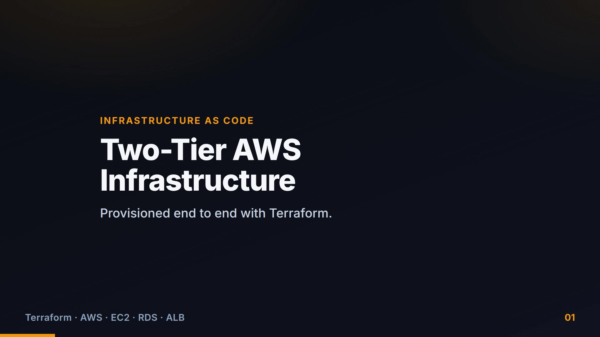
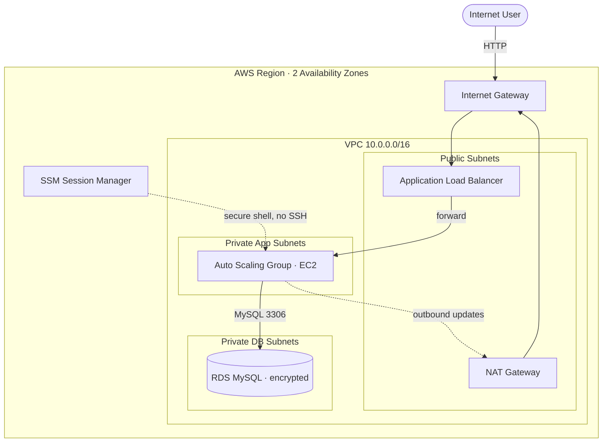

<div align="center">

# Two-Tier AWS Infrastructure with Terraform

**A highly-available, multi-AZ AWS architecture — load-balanced application tier and a private, encrypted database tier — provisioned end to end as code, deployed, verified, and torn down.**

[](https://www.terraform.io/)
[](https://aws.amazon.com/)
[](https://aws.amazon.com/ec2/)
[](https://aws.amazon.com/rds/)
[](#results--evidence)

<br/>

### 🎬 24-second explainer

[](media/explainer.mp4)

*Click the image to play the video.*

</div>

---

## The Problem

Most web applications need the same foundation: something public to receive traffic,
somewhere private to run the application, and a database that must **never** be reachable
from the internet. Building that by clicking through the AWS console is slow, inconsistent,
impossible to review, and painful to reproduce or delete.

This project solves it the way infrastructure teams actually work — **everything is code.**
One command stands the whole environment up; one command tears it down; every change is
reviewable in a pull request.

## What It Does

It provisions a complete **two-tier architecture** on AWS with Terraform:

- a **public tier** — an Application Load Balancer and an Auto Scaling Group of EC2 web servers,
- a **private data tier** — an encrypted Amazon RDS (MySQL) database with no path to the internet,

spread across **two Availability Zones** for fault tolerance, wired together with
least-privilege security groups and accessed without ever opening SSH.

## Architecture



### How a request flows
1. A user hits the load balancer's public DNS name.
2. The **Internet Gateway** admits that traffic to the **Application Load Balancer** in the public subnets.
3. The ALB health-checks and forwards to **EC2 instances in private subnets** — instances that have no public IP and cannot be reached directly from the internet.
4. Those instances query **Amazon RDS** in separate private subnets; the database security group accepts connections **only** from the application tier.
5. When instances need outbound internet (OS patches, package installs), they egress **outbound-only** through the **NAT Gateway**.
6. Operators open a shell through **AWS Systems Manager** — no bastion host, no SSH port, no key pairs.

## Key Engineering Decisions

The parts that show *judgement*, not just wiring:

| Decision | Why it was made |
|----------|-----------------|
| **Database in private subnets with no internet route** | Defence in depth — isolation at the routing layer, independent of security groups. Even a misconfigured rule can't expose it. |
| **Security groups trust *groups*, not IP ranges** | Instances come and go as the group auto-scales; referencing the ALB's security group means the rule never needs editing. |
| **SSM Session Manager instead of SSH** | Removes an entire attack surface (port 22, key distribution) and gives IAM-controlled, fully audited access. |
| **IMDSv2 enforced** | Blocks the SSRF-to-credential-theft path that plain instance metadata (IMDSv1) is vulnerable to. |
| **Single NAT Gateway by default, toggleable to per-AZ** | NAT is the main cost driver; the project defaults to cheap-for-demos but exposes one variable to switch to a highly-available per-AZ layout. |
| **Secrets never in code or state** | The database password is a sensitive input supplied at runtime; state and `*.tfvars` are gitignored. |
| **Validated before apply** | `terraform fmt`, `terraform validate`, and a native `terraform test` catch mistakes before anything reaches AWS. |

## Results & Evidence

Deployed to AWS (`ap-south-1`): a single `terraform apply` provisioned **38 resources with
zero errors**. The load balancer served the application from EC2 instances in **private**
subnets across both Availability Zones, confirming the full `Internet → ALB → private app →
private DB` path — after which the stack was destroyed to avoid ongoing charges.


*Served through the public ALB by an EC2 instance running in a private subnet. Refreshing
the page rotates the serving instance and AZ — visible proof of load balancing across zones.*

## Technology Stack

| Area | Technologies |
|------|--------------|
| Infrastructure as Code | Terraform (AWS provider `~> 5.0`), `terraform test` |
| Compute | EC2, Launch Templates, Auto Scaling Groups (rolling instance refresh) |
| Networking | VPC, public/private subnets, Internet Gateway, NAT Gateway, route tables, Application Load Balancer |
| Database | Amazon RDS (MySQL), DB subnet groups, encryption at rest |
| Security & access | IAM roles, security groups, SSM Session Manager, IMDSv2 |

## Repository Structure

```text
project-01-aws-two-tier-terraform/
├── terraform/        # VPC, security groups, IAM/SSM, ALB + ASG, RDS, outputs
├── scripts/          # instance bootstrap, deploy, and destroy helpers
├── tests/            # native terraform test
├── architecture/     # editable diagram and deployment screenshot
└── docs/             # implementation notes and troubleshooting guide
```

## Getting Started

```bash
git clone https://github.com/deba310984/aws-two-tier-terraform
cd aws-two-tier-terraform/project-01-aws-two-tier-terraform/terraform

export TF_VAR_db_password='your-strong-password'   # never committed
terraform init
terraform plan            # preview — nothing is created
terraform apply           # provisions AWS resources (NAT Gateway + ALB are billable)

curl "$(terraform output -raw alb_dns_name)"        # smoke test

terraform destroy         # tear down to stop charges
```

`plan`, `apply`, and `test` require AWS credentials; `fmt` and `validate` run offline once
the provider is downloaded. Deeper detail lives in the
[full project documentation](project-01-aws-two-tier-terraform/README.md),
[implementation notes](project-01-aws-two-tier-terraform/docs/implementation-notes.md), and
[troubleshooting guide](project-01-aws-two-tier-terraform/docs/troubleshooting.md).

## Cost & Cleanup

`t3.micro` EC2 and `db.t3.micro` RDS are free-tier eligible; the **NAT Gateway and ALB are
not** (roughly `$0.045/hr` each plus data). Always run `terraform destroy` when finished and
confirm no NAT Gateway, ALB, EC2, or RDS resources remain.

## What This Demonstrates

- Designing and shipping **cloud infrastructure as code**, not console clicks.
- **AWS networking fundamentals** — VPCs, subnetting/CIDR, routing, internet vs. NAT egress.
- **High availability** through multi-AZ load balancing and auto scaling.
- **Security engineering** — least privilege, network isolation, secretless pipelines, IMDSv2, SSH-less access.
- **Operational discipline** — plan-before-apply, automated validation, cost awareness, and clean teardown.
- A professional **Git/GitHub workflow** end to end.
