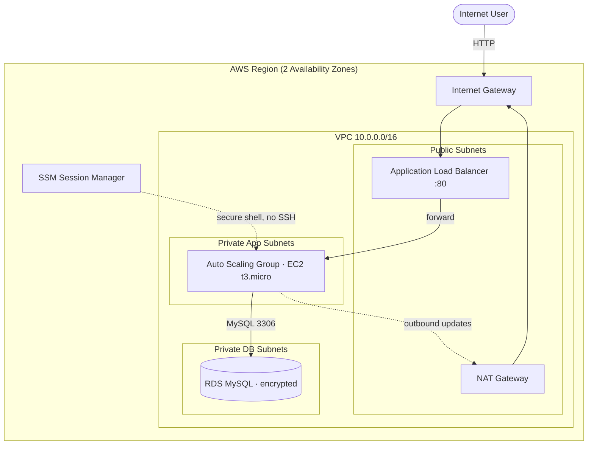

<div align="center">

# ☁️ Two-Tier AWS Infrastructure as Code — Terraform

### Highly-available, production-shaped AWS architecture provisioned entirely with Terraform

[](https://www.terraform.io/)
[](https://aws.amazon.com/)
[](https://aws.amazon.com/ec2/)
[](https://aws.amazon.com/rds/)
[](#)

**Deployed & verified on AWS** · 38 resources from a single `terraform apply` · Least-privilege networking · SSH-less (SSM) · Encrypted database

</div>

---

## 🎯 Overview

A complete **two-tier** web architecture — load-balanced application tier + private managed database — built **100% as code**, the way real infrastructure teams ship it:

- 🏗️ **Infrastructure as Code** with Terraform (modular files, variables, outputs, `terraform test`, version pinning)
- 🌐 **VPC networking across 2 Availability Zones** — public / private-app / private-db subnet tiers
- ⚖️ **Application Load Balancer + Auto Scaling Group** of EC2 instances (self-healing, multi-AZ, zero-downtime instance refresh)
- 🗄️ **Amazon RDS (MySQL)** — private, encrypted at rest, never reachable from the internet
- 🔒 **Defense-in-depth security** — least-privilege security-group chain (ALB → App → DB), **no SSH** (admin via SSM Session Manager), **IMDSv2 enforced**
- 💰 **Cost-aware & safe** — single-NAT toggle, secrets kept out of git, full teardown documented

> **Verified live:** applied to AWS (`ap-south-1`), the ALB served traffic from a private EC2 instance across AZs, then everything was destroyed to avoid charges. Screenshot below.

## 🗺️ Architecture



## 📸 Live deployment


*The Application Load Balancer serving the app from an EC2 instance running in a **private** subnet in `ap-south-1b` — proving the full `Internet → ALB → private app → private DB` flow.*

## 🧰 Tech stack

| Category | Technologies |
|----------|--------------|
| **IaC** | Terraform (AWS provider ~> 5.0), native `terraform test` |
| **Compute** | EC2, Launch Templates, Auto Scaling Groups |
| **Networking** | VPC, Subnets, Internet Gateway, NAT Gateway, Route Tables, Application Load Balancer |
| **Database** | Amazon RDS (MySQL), DB Subnet Groups |
| **Security** | IAM roles, Security Groups, SSM Session Manager, IMDSv2 |

## 🚀 Quick start

```bash
git clone https://github.com/deba310984/aws-two-tier-terraform
cd aws-two-tier-terraform/project-01-aws-two-tier-terraform/terraform

export TF_VAR_db_password='your-strong-password'   # never committed
terraform init
terraform plan          # preview — nothing created
terraform apply         # creates AWS resources (paid: NAT + ALB)

curl "$(terraform output -raw alb_dns_name)"        # smoke test

terraform destroy       # tear down to stop charges
```

## 📂 Documentation

📁 **[`project-01-aws-two-tier-terraform/`](project-01-aws-two-tier-terraform/)**

- 📘 [Full project README](project-01-aws-two-tier-terraform/README.md) — architecture deep-dive, security, cost, cleanup
- 🛠️ [Implementation notes](project-01-aws-two-tier-terraform/docs/implementation-notes.md) — design decisions & trade-offs
- 🧯 [Troubleshooting guide](project-01-aws-two-tier-terraform/docs/troubleshooting.md)

## 💡 Skills demonstrated

`AWS` · `Terraform` · `Infrastructure as Code` · `VPC design & subnetting` · `High availability (multi-AZ)` · `Load balancing & auto scaling` · `Cloud security (least privilege, IAM, IMDSv2)` · `Managed databases` · `Cost optimization` · `Git/GitHub workflow`
