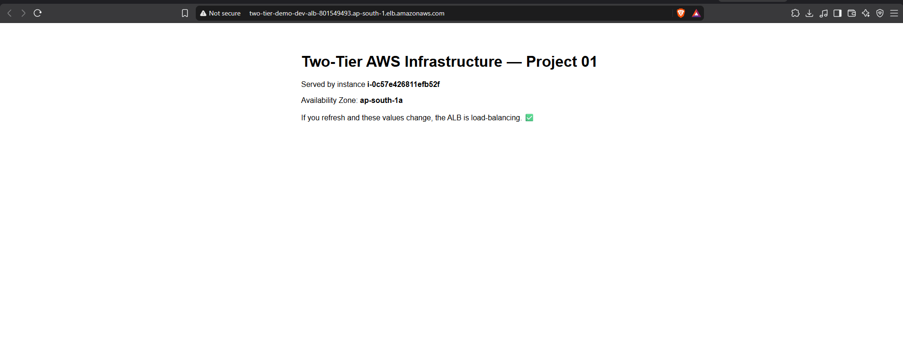

<div align="center">

# Two-Tier AWS Infrastructure with Terraform

**A highly-available, multi-AZ AWS architecture — application and data tiers — provisioned entirely as code.**

[](https://www.terraform.io/)
[](https://aws.amazon.com/)
[](https://aws.amazon.com/ec2/)
[](https://aws.amazon.com/rds/)
[](#results)

</div>

---

## Overview

This project provisions a production-shaped **two-tier architecture** on AWS using
**Terraform**. A public load-balanced application tier serves traffic while a private,
encrypted database tier remains fully isolated from the internet — the baseline pattern
behind most real-world web applications.

The entire stack is defined as code: reviewable, version-controlled, reproducible, and
destroyable on demand. It was deployed to AWS, verified end to end, and then torn down.

## Architecture


**Request flow:** Internet → Internet Gateway → Application Load Balancer (public subnets)
→ EC2 instances in an Auto Scaling Group (private subnets) → Amazon RDS (private subnets).
Instances reach the internet outbound-only through a NAT Gateway; administrators connect
through AWS Systems Manager, so no SSH port is ever exposed. The database is protected by
two independent layers: it sits in subnets with no internet route, and its security group
trusts only the application tier.

## Highlights

- **Multi-AZ by design** — one VPC spanning two Availability Zones with three subnet tiers (public, private-app, private-db).
- **Elastic application tier** — an Application Load Balancer in front of an Auto Scaling Group, with zero-downtime rolling instance refresh.
- **Managed, private database** — Amazon RDS (MySQL), encrypted at rest and never publicly accessible.
- **Least-privilege networking** — a one-way security-group chain (ALB → App → DB) that trusts tiers by reference, not by IP.
- **Secure access** — SSH-less administration via SSM Session Manager and enforced IMDSv2.
- **Safe operations** — secrets and state kept out of version control; `terraform fmt`, `validate`, and a native `terraform test` guardrail.

## Results

Deployed to AWS (`ap-south-1`): a single `terraform apply` provisioned **38 resources** with
zero errors. The load balancer served the application from EC2 instances in private subnets
across both Availability Zones, after which the stack was destroyed to avoid ongoing charges.



## Technology Stack

| Area | Technologies |
|------|--------------|
| Infrastructure as Code | Terraform (AWS provider `~> 5.0`), `terraform test` |
| Compute | EC2, Launch Templates, Auto Scaling Groups |
| Networking | VPC, subnets, Internet Gateway, NAT Gateway, route tables, Application Load Balancer |
| Database | Amazon RDS (MySQL), DB subnet groups |
| Security & access | IAM, security groups, SSM Session Manager, IMDSv2 |

## Repository Structure

```text
project-01-aws-two-tier-terraform/
├── terraform/        # VPC, security groups, IAM/SSM, ALB + ASG, RDS, outputs
├── scripts/          # instance bootstrap, deploy, and destroy helpers
├── tests/            # native terraform test
├── architecture/     # editable diagram and deployment screenshot
└── docs/             # implementation notes and troubleshooting guide
```

## Getting Started

```bash
git clone https://github.com/deba310984/aws-two-tier-terraform
cd aws-two-tier-terraform/project-01-aws-two-tier-terraform/terraform

export TF_VAR_db_password='your-strong-password'   # never committed
terraform init
terraform plan            # preview — nothing is created
terraform apply           # provisions AWS resources (NAT Gateway + ALB are billable)

curl "$(terraform output -raw alb_dns_name)"        # smoke test

terraform destroy         # tear down to stop charges
```

`plan`, `apply`, and `test` require AWS credentials; `fmt` and `validate` run offline once
the provider is downloaded. See the
[full project documentation](project-01-aws-two-tier-terraform/README.md) for details,
and the [implementation notes](project-01-aws-two-tier-terraform/docs/implementation-notes.md)
for design decisions.

## Cost & Cleanup

`t3.micro` EC2 and `db.t3.micro` RDS are free-tier eligible; the **NAT Gateway and ALB are
not** (roughly `$0.045/hr` each plus data). Always run `terraform destroy` when finished and
confirm no NAT Gateway, ALB, EC2, or RDS resources remain.

## Skills Demonstrated

Infrastructure as Code · AWS VPC design & subnetting · high availability (multi-AZ) ·
load balancing & auto scaling · managed databases · cloud security (least privilege, IAM,
IMDSv2, SSH-less access) · cost awareness · Git/GitHub workflow.
