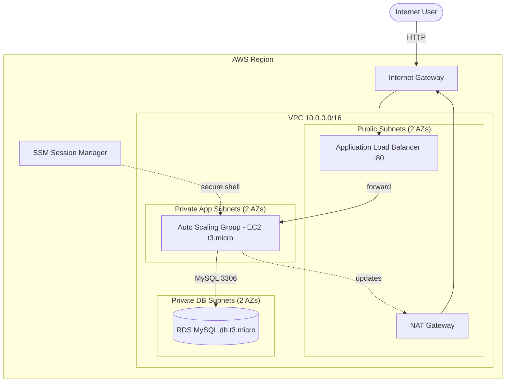

# Project 01 — Two-Tier AWS Infrastructure with Terraform

> **Portfolio No.:** 1 &nbsp;|&nbsp; **Original Reference No.:** #11
> **Reference:** [NotHarshhaa/DevOps-Projects — DevOps-Project-11](https://github.com/NotHarshhaa/DevOps-Projects/tree/master/DevOps-Project-11)
> **Status:** ✅ Code complete & format-validated · ⏳ AWS apply/test pending (run by repo owner)

Provision a classic **two-tier AWS architecture** — a public web/application
tier and a private data tier — entirely with **Terraform**, across two
Availability Zones, following least-privilege networking and SSH-less
instance access via AWS Systems Manager.

## Table of Contents
- [Overview & problem statement](#overview--problem-statement)
- [Real-world use case](#real-world-use-case)
- [Features & objectives](#features--objectives)
- [Architecture](#architecture)
- [Architecture explanation](#architecture-explanation)
- [Scope: reference vs implemented](#scope-reference-vs-implemented)
- [Technology stack](#technology-stack)
- [Repository structure](#repository-structure)
- [Prerequisites](#prerequisites)
- [Installation & configuration](#installation--configuration)
- [Step-by-step implementation](#step-by-step-implementation)
- [Testing & validation](#testing--validation)
- [Security considerations](#security-considerations)
- [Monitoring & troubleshooting](#monitoring--troubleshooting)
- [Execution evidence](#execution-evidence)
- [Known limitations](#known-limitations)
- [Cost considerations](#cost-considerations)
- [Cleanup](#cleanup)
- [Interview preparation](#interview-preparation)
- [References & attribution](#references--attribution)
- [Future improvements](#future-improvements)
- [Implementation checklist](#implementation-checklist)

## Overview & problem statement
Clicking resources together in the AWS console is slow, error-prone, and not
repeatable. This project describes a complete two-tier stack **as code** so it
can be reviewed, versioned, recreated identically, and destroyed on demand.

## Real-world use case
This is the baseline pattern behind most web applications: a load-balanced,
auto-scaling application tier that talks to a managed database kept fully
private, with neither the app servers nor the database directly exposed to the
internet.

## Features & objectives
- One VPC across **2 Availability Zones** for fault tolerance.
- **Three subnet tiers**: public (ALB/NAT), private-app (EC2), private-db (RDS).
- **Application Load Balancer** fronting an **Auto Scaling Group** of EC2 instances.
- **Amazon RDS (MySQL)**, encrypted, private, never internet-reachable.
- **Least-privilege security groups** forming a one-way ALB → App → DB chain.
- **No SSH**: admin shell via **SSM Session Manager** (IAM role, IMDSv2 enforced).
- Secrets kept out of git; `terraform fmt` clean; native `terraform test` assertions.

## Architecture
Editable source: [`architecture/architecture.mmd`](architecture/architecture.mmd)



## Architecture explanation
1. A user hits the ALB's public DNS name over HTTP (port 80).
2. The **Internet Gateway** admits that traffic to the **ALB** in the public subnets.
3. The ALB forwards to healthy EC2 instances in the **private app subnets**. Those instances have no public IP and cannot be reached directly from the internet.
4. App instances query **RDS** in the **private db subnets** on port 3306. The DB security group accepts connections **only** from the app security group.
5. For outbound needs (OS patches, package installs, SSM endpoints), private instances egress through the **NAT Gateway** — outbound only, never inbound.
6. Administrators get a shell through **SSM Session Manager**, so no SSH port is ever open.

**Two independent isolation layers protect the database:** it sits in a subnet with *no* internet route at all, *and* its security group trusts only the app tier.

## Scope: reference vs implemented
| Component | This project | Reference #11 |
|-----------|:---:|:---:|
| VPC, subnets, IGW, NAT, route tables | ✅ | ✅ |
| ALB + Auto Scaling Group + EC2 | ✅ | ✅ |
| RDS (MySQL) | ✅ | ✅ |
| Tiered security groups | ✅ | ✅ |
| SSM Session Manager (no SSH) | ✅ | — |
| Route 53 / CloudFront / ACM / WAF / S3 | 📋 future | ✅ |

The reference spans many services; this build implements the **core two-tier
pattern** and documents the rest as [future improvements](#future-improvements)
to stay focused and cost-aware.

## Technology stack
| Tech | Role | Why |
|------|------|-----|
| **Terraform ≥ 1.5** | IaC engine | Declarative plan/apply, state, reproducibility |
| **AWS VPC** | Network | Isolated network with tiered subnets |
| **EC2 + Launch Template + ASG** | App tier | Elastic, self-healing compute |
| **Application Load Balancer** | Traffic | Health-checked HTTP distribution across AZs |
| **Amazon RDS (MySQL)** | Data tier | Managed DB, kept private + encrypted |
| **IAM + SSM** | Access | Least-privilege; shell without exposing SSH |

## Repository structure
```text
project-01-aws-two-tier-terraform/
├── README.md
├── .gitignore
├── architecture/
│   ├── architecture.mmd
│   └── images/                  # add rendered diagram / screenshots here
├── terraform/
│   ├── versions.tf              # Terraform + provider version pins
│   ├── providers.tf             # AWS provider + default tags
│   ├── variables.tf             # all input variables (with validation)
│   ├── network.tf               # VPC, subnets, IGW, NAT, routes
│   ├── securitygroups.tf        # ALB -> App -> DB SG chain
│   ├── iam.tf                   # EC2 SSM role + instance profile
│   ├── compute.tf               # launch template, ALB, target group, ASG
│   ├── rds.tf                   # DB subnet group + RDS instance
│   ├── outputs.tf               # ALB URL, endpoints, IDs
│   └── terraform.tfvars.example # safe sample values (no secrets)
├── scripts/
│   ├── user_data.sh             # instance bootstrap (Apache + info page)
│   ├── deploy.sh                # fmt -> init -> validate -> plan
│   └── destroy.sh               # guarded teardown
├── tests/
│   └── plan.tftest.hcl          # native terraform test assertions
└── docs/
    ├── implementation-notes.md
    ├── troubleshooting.md
    ├── interview-prep.md
    └── progress.md
```

## Prerequisites
- Terraform **≥ 1.5.0**
- AWS account + credentials configured (`aws configure`, env vars, or an IAM role)
- An IAM identity allowed to manage VPC / EC2 / ELB / RDS / IAM resources

> This project was authored and format-validated in a cloud container whose
> network policy blocks the Terraform registry, so `init`/`validate`/`plan`
> are run by the repo owner on a machine with AWS credentials.

## Installation & configuration
```bash
git clone https://github.com/deba310984/Project_1
cd Project_1/project-01-aws-two-tier-terraform/terraform

# Optional: copy and edit non-secret variables
cp terraform.tfvars.example terraform.tfvars   # terraform.tfvars is gitignored

# Provide the DB password WITHOUT committing it:
export TF_VAR_db_password='choose-a-strong-password'
```

## Step-by-step implementation
```bash
terraform init          # download the AWS provider, set up state
terraform fmt -check     # formatting gate
terraform validate       # => Success! The configuration is valid.
terraform plan           # review ~30 resources; nothing created yet
terraform apply          # CREATES PAID RESOURCES — confirm when prompted
```
Or use the helper: `./scripts/deploy.sh` (does fmt → init → validate → plan).

## Testing & validation
- **Format:** `terraform fmt -check -recursive` — ✅ passes.
- **Validate:** `terraform validate` — run on a machine with the provider.
- **Automated test:** `cd terraform && terraform test` runs
  [`tests/plan.tftest.hcl`](tests/plan.tftest.hcl), asserting subnet counts and
  that RDS is private + encrypted (needs AWS creds; it plans, creates nothing).
- **Post-apply smoke test:**
  ```bash
  curl "$(terraform output -raw alb_dns_name)"   # expect the demo HTML
  ```
  Refresh a few times — the instance ID / AZ should change as the ALB balances.

## Security considerations
- **No SSH anywhere** — access via SSM Session Manager only.
- **IMDSv2 enforced** (`http_tokens = required`) to block instance-metadata credential theft.
- **RDS**: `publicly_accessible = false`, `storage_encrypted = true`, in private subnets with no internet route.
- **Least-privilege SGs**: each tier trusts only the tier in front of it, by security-group reference (not IP).
- **Secrets**: DB password is a sensitive variable with no default; `.gitignore` blocks state, `*.tfvars`, and keys.
- Run `terraform plan` and review before every apply; never commit `*.tfstate`.

## Monitoring & troubleshooting
- EC2 + ALB + RDS emit metrics to **CloudWatch** by default (CPU, request counts, DB connections).
- ALB **target health** shows whether instances pass the HTTP health check.
- See [`docs/troubleshooting.md`](docs/troubleshooting.md) for common failure modes (unhealthy targets, NAT/egress issues, RDS connectivity, SSM not connecting).

## Execution evidence
> No screenshots yet — these are added after the repo owner runs `apply`.
> Place rendered diagram and console/CLI screenshots in `architecture/images/`.
> **Do not** paste real endpoints, account IDs, or secrets into screenshots.

## Known limitations
- Single NAT Gateway by default (cost over strict HA) — toggle `single_nat_gateway = false` for one-per-AZ.
- RDS is single-AZ by default (`db_multi_az = false`).
- HTTP only (no TLS/ACM/Route 53) — see future improvements.
- `skip_final_snapshot = true` and `deletion_protection = false` for easy demo teardown — unsafe for production.
- Local Terraform state by default; enable a remote backend for teams.

## Cost considerations
| Resource | Free-tier? | Notes |
|----------|-----------|-------|
| EC2 `t3.micro` ×2 | Partly (750 hrs/mo, one instance) | 2 instances may exceed free tier |
| RDS `db.t3.micro` | Yes (12 mo, limits) | single-AZ, 20 GB gp3 |
| **NAT Gateway** | ❌ No | ~$0.045/hr + data — main cost driver |
| **ALB** | ❌ No | hourly + LCU charges |
| EIP (attached) | Free while attached | charged if left unattached |

Estimates only — verify current pricing for your region. **Always destroy when done.**

## Cleanup
```bash
cd terraform
terraform destroy          # or ../scripts/destroy.sh
```
Then confirm in the console that no **NAT Gateway, ALB, EC2, or RDS** remains
(these are the billable resources), and release any unattached EIPs.

## Interview preparation
Full sheet: [`docs/interview-prep.md`](docs/interview-prep.md). Quick hits:
- **What makes a subnet public?** A route `0.0.0.0/0 → IGW`. Nothing else.
- **How do private instances patch without inbound exposure?** NAT Gateway (outbound only).
- **Why SG references instead of IPs?** They survive auto-scaling — trust the tier, not an address.
- **Why IMDSv2?** Token-required metadata blocks SSRF-based credential theft.
- **Where do Terraform secrets leak, and how do you prevent it?** Committed state / tfvars → remote encrypted state, `.gitignore`, sensitive vars, secrets managers.

## References & attribution
- Reference project: [NotHarshhaa/DevOps-Projects #11](https://github.com/NotHarshhaa/DevOps-Projects/tree/master/DevOps-Project-11) (scope inspiration; this is an independent implementation).
- [Terraform AWS Provider docs](https://registry.terraform.io/providers/hashicorp/aws/latest/docs)
- [AWS VPC](https://docs.aws.amazon.com/vpc/) · [Auto Scaling](https://docs.aws.amazon.com/autoscaling/) · [RDS](https://docs.aws.amazon.com/rds/) · [SSM Session Manager](https://docs.aws.amazon.com/systems-manager/latest/userguide/session-manager.html)

## Future improvements
- HTTPS: ACM certificate + 443 listener + HTTP→HTTPS redirect.
- Route 53 hosted zone + alias record to the ALB.
- CloudFront CDN and AWS WAF in front of the ALB.
- S3 bucket for static assets; CloudWatch alarms + dashboards.
- Refactor into reusable modules (that becomes Portfolio Project 2).
- Remote state (S3 + DynamoDB lock) and CI `fmt`/`validate`/`tflint`/`checkov` checks.

## Implementation checklist
- [x] Phase 0 — scaffold + Terraform foundation
- [x] Phase 1 — networking (VPC, subnets, IGW, NAT, routes)
- [x] Phase 2 — security groups (ALB → App → DB)
- [x] Phase 3 — application tier (launch template, ALB, ASG, SSM role)
- [x] Phase 4 — data tier (RDS)
- [x] Phase 5 — outputs, helper scripts, terraform test
- [x] Phase 7 — documentation, interview sheet
- [ ] Phase 6 — **(owner)** `apply`, smoke-test, screenshots, then `destroy`
- [ ] `terraform validate` / `plan` confirmed green on owner's machine
- [ ] Execution screenshots added to `architecture/images/`

---
*Part of a DevOps/SRE portfolio. Reference: NotHarshhaa/DevOps-Projects #11. Independent implementation — not a copy of the reference.*
